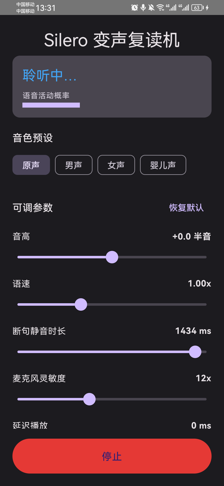

# Silero Voice-Changer Repeater


**English** | [简体中文](README.zh-CN.md)

An Android app that listens while you speak, uses **Silero VAD** to detect when you finish a sentence, then automatically **replays it with a changed voice**. Switch between original / male / female / baby presets, and tune pitch, tempo, endpoint sensitivity, mic sensitivity, and playback delay in real time.

## Features

- 🎙️ **Real-time endpoint detection** powered by Silero VAD (ONNX) — automatically detects "end of sentence"
- 🗣️ **Voice-changed repeat** — once a full utterance is detected, it is pitch/tempo-shifted via SoundTouch and played back
- 🎚️ **Voice presets** — original / male / female / baby, one tap to switch
- 🎛️ **Tunable parameters** (sliders, applied live):
  - Pitch (−12 to +12 semitones)
  - Tempo (0.5x to 2.0x)
  - Silence tail for endpointing (300–1500 ms)
  - Mic sensitivity (VAD input gain 1x–30x, adapts to different devices' recording levels)
  - Playback delay (0–3000 ms)
- 🔁 **One-tap reset to defaults**
- 🔇 **Strict half-duplex** — no detection during playback; waits for echo to decay before re-arming, avoiding loudspeaker self-feedback loops

## How it works

```
Microphone → AudioRecord (16kHz / mono / PCM16)
           → Silero VAD (ONNX, speech probability every 512 samples = 32ms)
           → Endpoint detection (enter/exit thresholds + trailing silence = "done")
           → Buffer the whole utterance as PCM
           → SoundTouch voice change (pitch + tempo shift, JNI/C++)
           → AudioTrack playback
```

Recording is paused during playback so the app doesn't re-record its own output.

## Screenshots

<p align="center">
  
</p>

## Download

Prebuilt APKs are published on the [Releases](https://github.com/bigorangecloud/voice-repeater/releases) page. Or build it yourself (see [Build](#build)).

## Modules

| File | Responsibility |
|------|------|
| `audio/SileroVad.kt` | Silero VAD v5 ONNX inference wrapper |
| `audio/RepeatEngine.kt` | Core loop: recording + VAD endpointing + triggering voice-change playback |
| `audio/VoiceChanger.kt` | Applies voice parameters to a full PCM segment |
| `audio/SoundTouch.kt` | Kotlin wrapper over the SoundTouch JNI |
| `audio/VoiceParams.kt` | Voice parameters and preset timbres |
| `audio/AudioPlayer.kt` | AudioTrack PCM playback |
| `cpp/soundtouch_jni.cpp` | Custom JNI: processes PCM short arrays in memory |
| `cpp/soundtouch/` | SoundTouch core C++ sources (official codeberg mirror) |
| `MainViewModel.kt` / `*.kt (UI)` | Compose UI and state |

## A note on "voice changing"

SoundTouch's pitch shifting is based on "resampling + time-stretching", so formants move together with pitch — which is exactly the natural source of the male/female/baby timbre difference. This app therefore shapes timbre using two real, controllable dimensions — **pitch (semitones) + tempo** — rather than faking independent formant shifting.

## Requirements & permissions

- Android 7.0 (API 24) or higher
- Requires the **microphone permission** (`RECORD_AUDIO`) at runtime — used to record and detect speech

## Build

Requires a local Android SDK (with NDK 26.x, CMake 3.22.1, platform-34).

```powershell
# Command-line build (JAVA_HOME pointing at JDK 17+)
.\gradlew.bat assembleDebug
# Output: app\build\outputs\apk\debug\app-debug.apk
```

Or open this directory in Android Studio, wait for Gradle sync, and hit Run.

## Known limitations

- **Recording levels vary a lot across devices**: some devices (e.g. Huawei/Honor) apply aggressive system noise suppression that pushes the recording level very low, so detection may be insensitive at the default. If you hit "speaking does nothing", raise the **Mic sensitivity** slider; on devices with normal levels you can lower it to reduce false triggers.
- **Loudspeaker echo**: at higher volumes the playback can be re-picked up by the mic. The app already does half-duplex + echo-decay handling, but **using headphones** physically eliminates the coupling for the cleanest experience.
- Voice changing is based on pitch+tempo transformation, not independent formant modeling; audio quality degrades at extreme settings.

## Contributing

Issues and PRs are welcome. Suggested flow:

1. Fork the repo and create a branch (`feature/xxx` or `fix/xxx`)
2. Keep the code style consistent with the existing code (official Kotlin style + Compose)
3. Verify the record / detect / playback pipeline works on a real device
4. Open a PR describing the change and how you tested it

## Acknowledgements

- [Silero Team](https://github.com/snakers4/silero-vad) — a high-quality, lightweight open-source voice activity detection model
- [Olli Parviainen / SoundTouch](https://codeberg.org/soundtouch/soundtouch) — open-source pitch/tempo transformation library

## Versioning & releases

This project follows [Semantic Versioning](https://semver.org/): `MAJOR.MINOR.PATCH`.

| Change | Next version | Example |
|--------|-------------|---------|
| Bug fixes / small tweaks, no behavior change | bump **PATCH** | `1.0.0` → `1.0.1` |
| New backward-compatible features | bump **MINOR** | `1.0.0` → `1.1.0` |
| Breaking changes / major rework | bump **MAJOR** | `1.x` → `2.0.0` |

Release checklist:

1. Update `versionName` and **increment `versionCode` by 1** in `app/build.gradle.kts` (Android uses `versionCode` to decide upgrades; a duplicate code blocks installation).
2. Build the signed APK: `.\gradlew.bat assembleRelease`
3. Create a git tag matching the version (e.g. `v1.1.0`) and push it.
4. Draft a GitHub Release on that tag and attach `app-release.apk`.

## License

This project is mainly licensed under the **MIT License** — see [LICENSE](LICENSE).

> ⚠️ **Third-party license notice**: the SoundTouch sources under `app/src/main/cpp/soundtouch/` are licensed under **LGPL v2.1** and are **not** covered by MIT; their copyright belongs to the original author. If you distribute this app or derivative works, you must comply with the LGPL obligations (retain the copyright and license notices, allow end users to replace that library, etc.). The Silero VAD model follows the license of its upstream repository.
